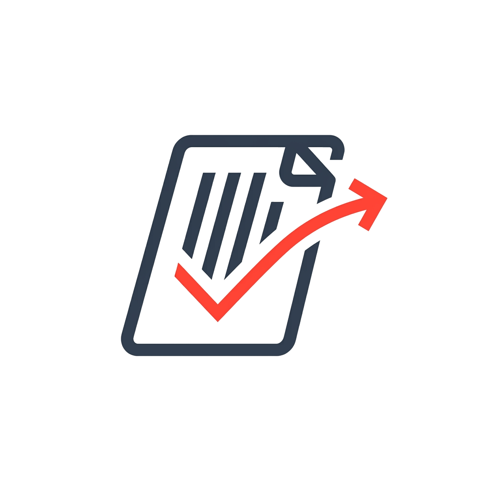
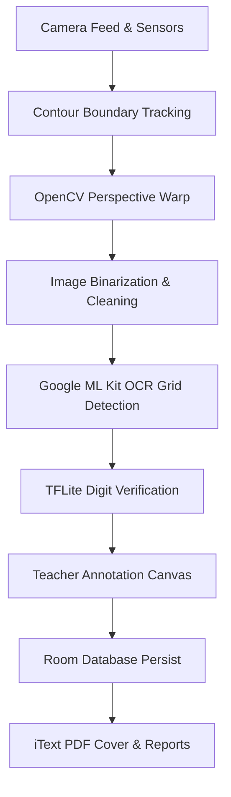

# MarkFlow 📄🖋️

[](https://developer.android.com)
[](https://kotlinlang.org)
[](#license)
[](https://opencv.org)
[](https://tensorflow.org/lite)

**MarkFlow** is an intelligent, document-processing-first Android application designed to streamline the grading, digitization, and verification workflow for evaluated academic answer sheets.

Unlike generic document scanning applications, MarkFlow acts as an end-to-end evaluation assistant. It leverages native computer vision (OpenCV) for real-time edge tracking and perspective correction, guides physical camera alignment using device accelerometers, utilizes on-device machine learning (ML Kit & TensorFlow Lite) for digit verification, and features an interactive overlay canvas that maps gestures to high-resolution bitmaps for direct grading annotation.

<p align="center">
  
</p>

---

## Features

- **Document Scanning & Deskewing**: Orchestrates CameraX preview feeds inside [ScanScreen.kt](file:///C:/Users/JAISINGH/.gemini/antigravity-ide/scratch/MarkFlow/app/src/main/java/com/markflow/app/ui/scan/ScanScreen.kt) to capture documents. The [ContourAnalyzer.kt](file:///C:/Users/JAISINGH/.gemini/antigravity-ide/scratch/MarkFlow/app/src/main/java/com/markflow/app/cv/ContourAnalyzer.kt) dynamically tracks paper boundaries and runs OpenCV perspective warping to output a flattened page layout.
- **Red Ink Detection & Canvas Drawing**: Leverages native color processing in [RedInkFilter.kt](file:///C:/Users/JAISINGH/.gemini/antigravity-ide/scratch/MarkFlow/app/src/main/java/com/markflow/app/cv/RedInkFilter.kt) to isolate red pen corrections. Enables physical-to-digital gesture writing inside [PageViewScreen.kt](file:///C:/Users/JAISINGH/.gemini/antigravity-ide/scratch/MarkFlow/app/src/main/java/com/markflow/app/ui/pageview/PageViewScreen.kt), directly writing stroke markers onto high-resolution files.
- **Blank Page & Duplicate Detection**: Employs [PageChangeDetector.kt](file:///C:/Users/JAISINGH/.gemini/antigravity-ide/scratch/MarkFlow/app/src/main/java/com/markflow/app/cv/PageChangeDetector.kt) and [DuplicateDetector.kt](file:///C:/Users/JAISINGH/.gemini/antigravity-ide/scratch/MarkFlow/app/src/main/java/com/markflow/app/cv/DuplicateDetector.kt) pipelines to identify blank regions, prevent double scans, and ensure complete answer sheet collation.
- **OCR Extraction & Verification**: Utilizes [OcrProcessor.kt](file:///C:/Users/JAISINGH/.gemini/antigravity-ide/scratch/MarkFlow/app/src/main/java/com/markflow/app/ml/OcrProcessor.kt) (Google ML Kit) to parse structured layout grids and extract handwritten digits, feeding cropped regions to [DigitRecognizer.kt](file:///C:/Users/JAISINGH/.gemini/antigravity-ide/scratch/MarkFlow/app/src/main/java/com/markflow/app/ml/DigitRecognizer.kt) for on-device validation.
- **Academic Record Digitization**: Saves and tracks detailed evaluation sessions, copies, and student marks in Room SQLite tables (defined in [MarkFlowDatabase.kt](file:///C:/Users/JAISINGH/.gemini/antigravity-ide/scratch/MarkFlow/app/src/main/java/com/markflow/app/data/local/MarkFlowDatabase.kt)).
- **PDF Export with cover sheets**: Dynamically compiles digital evaluations into comprehensive archives containing grading metrics, class averages, passing distributions, and cropped proof images via [ReportGenerator.kt](file:///C:/Users/JAISINGH/.gemini/antigravity-ide/scratch/MarkFlow/app/src/main/java/com/markflow/app/util/ReportGenerator.kt).

---

## Screenshots

| 📱 **Main Dashboard** | 📸 **Document Capture** | ✏️ **Red Ink Annotation** | 📊 **Cohort Analytics** |
| :---: | :---: | :---: | :---: |
|  |  |  |  |
| *Manage active grading sessions, import student lists, and trace cohort history* | *Warp-perspective capture guide with dynamic tilt sensors and automated torch control* | *Direct Compose Canvas writing to overlay grades, verify OCR, and circle answers* | *Dynamic dropdowns, grading bands, class passing ratios, and statistics* |

---

## How It Works



1. **Capture & Edge Alignment**: The camera preview feed inside [ScanScreen.kt](file:///C:/Users/JAISINGH/.gemini/antigravity-ide/scratch/MarkFlow/app/src/main/java/com/markflow/app/ui/scan/ScanScreen.kt) monitors device sensor tilt angles. The [ContourAnalyzer.kt](file:///C:/Users/JAISINGH/.gemini/antigravity-ide/scratch/MarkFlow/app/src/main/java/com/markflow/app/cv/ContourAnalyzer.kt) tracks the physical boundary of the answer sheet, executing an OpenCV perspective warp once stable.
2. **Adaptive Cleaning**: The warped document bitmap undergoes local binarization, shadow extraction, and background noise removal in [ImageProcessor.kt](file:///C:/Users/JAISINGH/.gemini/antigravity-ide/scratch/MarkFlow/app/src/main/java/com/markflow/app/cv/ImageProcessor.kt) to maximize visibility.
3. **On-Device OCR & ML Verification**: The cleaned image is processed by [OcrProcessor.kt](file:///C:/Users/JAISINGH/.gemini/antigravity-ide/scratch/MarkFlow/app/src/main/java/com/markflow/app/ml/OcrProcessor.kt) to index character locations. Extracted number grids are validated against a local TensorFlow Lite model via [DigitRecognizer.kt](file:///C:/Users/JAISINGH/.gemini/antigravity-ide/scratch/MarkFlow/app/src/main/java/com/markflow/app/ml/DigitRecognizer.kt) with validation confidence scores calculated by [ConfidenceCalculator.kt](file:///C:/Users/JAISINGH/.gemini/antigravity-ide/scratch/MarkFlow/app/src/main/java/com/markflow/app/ml/ConfidenceCalculator.kt).
4. **Touch Drawing Coordinate Translation**: In [PageViewScreen.kt](file:///C:/Users/JAISINGH/.gemini/antigravity-ide/scratch/MarkFlow/app/src/main/java/com/markflow/app/ui/pageview/PageViewScreen.kt), user inputs are mapped to pixel-perfect bitmap coordinates via [BitmapUtils.kt](file:///C:/Users/JAISINGH/.gemini/antigravity-ide/scratch/MarkFlow/app/src/main/java/com/markflow/app/util/BitmapUtils.kt), committing teacher grade corrections directly into physical file structures using [FileUtils.kt](file:///C:/Users/JAISINGH/.gemini/antigravity-ide/scratch/MarkFlow/app/src/main/java/com/markflow/app/util/FileUtils.kt).
5. **Persistence & Export**: Evaluations are synchronized into SQLite tables via [MarkFlowDatabase.kt](file:///C:/Users/JAISINGH/.gemini/antigravity-ide/scratch/MarkFlow/app/src/main/java/com/markflow/app/data/local/MarkFlowDatabase.kt). Finalized session metrics are exported into reports (PDF cover sheets, CSV, or Excel templates) using [ReportGenerator.kt](file:///C:/Users/JAISINGH/.gemini/antigravity-ide/scratch/MarkFlow/app/src/main/java/com/markflow/app/util/ReportGenerator.kt).

---

## Tech Stack

| Category | Technology | Usage in MarkFlow |
| :--- | :--- | :--- |
| **Core Runtime** | Kotlin (JDK 17) / Android SDK | Primary development framework, targeting Android API levels 29 to 35 |
| **UI Framework** | Jetpack Compose (Material 3) | Modern declarative layouts, fluid navigation, and custom charts |
| **Camera Platform** | Android CameraX | Multi-threaded image analysis, light sensing, and automated torch control |
| **Computer Vision** | OpenCV Android SDK (Native C++) | Real-time boundary contour tracking, matrix transforms, and image warping |
| **Machine Learning** | Google ML Kit OCR & TensorFlow Lite | High-speed text extraction grids and digit recognition validation |
| **Local Storage** | Room DB (SQLite) | Persistent copies, scores, session statistics, and validation audit logs |
| **Dependency Injection** | Dagger Hilt | Decentralized architecture decoupling, modular repositories, and view models |
| **Export Engines** | iText PDF (v5.x), Apache POI & OpenCSV | Multi-format grading reports, cover generation, and data spreadsheets |

---

## Installation

### Prerequisites
* Android Studio (Koala/Ladybug or newer)
* Android SDK (API levels 29 to 35 configured)
* Native C++ developer components (CMake & NDK configured in Android Studio)
* JDK 17

### Gradle Build Instructions
Compile the project from the root folder:

```bash
# Clone the repository
git clone https://github.com/username/MarkFlow.git
cd MarkFlow

# Build Debug APK (Ideal for local testing)
./gradlew assembleDebug

# Build Unsigned Release APK (Minified and optimized production build)
./gradlew assembleRelease
```

Once compiled successfully, output files will be written to:
* **Debug APK**: `app/build/outputs/apk/debug/app-debug.apk`
* **Release APK**: `app/build/outputs/apk/release/app-release-unsigned.apk`

---

## Roadmap

- **AI Handwriting Recognition**: Upgrade existing TensorFlow Lite models to recognize cursive handwriting and complex math symbols on handwritten papers.
- **Multi-Page Processing**: Implement automatic collation, sorting, and stitching of multi-page student answer scripts under a single index.
- **Teacher Dashboard**: Build a web-based portal to sync evaluation records and manage grades across cohorts.
- **Cloud Sync**: Secure cloud-backup integration to synchronize grading status, metrics, and digital copies across devices.

---

## Contributing

We welcome contributions to MarkFlow! Follow these guidelines to update and extend code:

### 1. Database Schema Changes (Room)
The database definitions reside in `com.markflow.app.data.local/`.
1. Modify/Create Entity: Update or add a new file in `entity/` (e.g. [CopyEntity.kt](file:///C:/Users/JAISINGH/.gemini/antigravity-ide/scratch/MarkFlow/app/src/main/java/com/markflow/app/data/local/entity/CopyEntity.kt)).
2. Register in Database: Open [MarkFlowDatabase.kt](file:///C:/Users/JAISINGH/.gemini/antigravity-ide/scratch/MarkFlow/app/src/main/java/com/markflow/app/data/local/MarkFlowDatabase.kt), add your entity class, and increment the database version.
3. Write Migrations: Add schema migration logic in `MarkFlowDatabase.kt` and register it in the builder inside [AppModule.kt](file:///C:/Users/JAISINGH/.gemini/antigravity-ide/scratch/MarkFlow/app/src/main/java/com/markflow/app/di/AppModule.kt). Room exports schema JSONs to `app/schemas/` upon compilation. Commit these JSON files to git.

### 2. Updating Dependencies
All libraries are declared in the version catalog: [libs.versions.toml](file:///C:/Users/JAISINGH/.gemini/antigravity-ide/scratch/MarkFlow/gradle/libs.versions.toml). Add updates under `[versions]` and libraries under `[libraries]`, and link them in the target module's `build.gradle.kts`.

### 3. Minification & Optimization (ProGuard / R8)
If external dependencies require special handling under R8 compilation, update rules inside [proguard-rules.pro](file:///C:/Users/JAISINGH/.gemini/antigravity-ide/scratch/MarkFlow/app/proguard-rules.pro).

---

## License

This project is licensed under the Apache License 2.0. See the `LICENSE` file for details.
