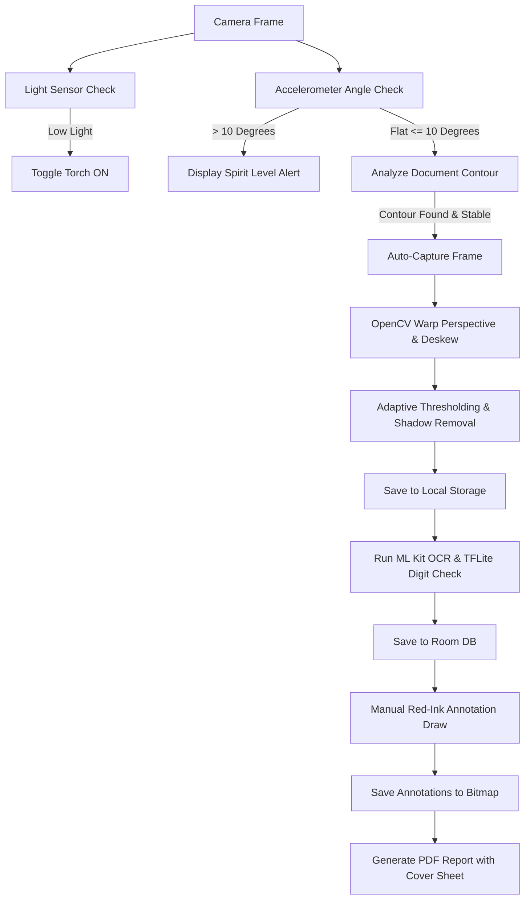

# MarkFlow 📄🖋️

MarkFlow is a professional-grade document scanning, processing, and evaluation application built for Android. Specifically designed for teachers and evaluators, MarkFlow transforms mobile devices into high-precision answer sheet document scanners (comparable to Adobe Scan or Microsoft Lens) while integrating automatic mark verification, cohort analytics, and annotated PDF reports.

---

## 🌟 Key Features

### 1. Document-First Camera & Image Processing
* **Perspective Correction (Deskewing)**: Automatic corner-point detection and perspective transformation (warp perspective) to remove page tilt.
* **Smart Enhancements**: Adaptive binarization and contrast optimization to erase shadows, background desk surfaces, and creases while maintaining text clarity.
* **Auto-Capture & Page Detection**: Automatically triggers capture once a document is stable and correctly bounded, checking for page duplicates.

### 2. Digital Spirit Level (Angle Guidance)
* **Real-time Alignment**: Integrated accelerometer sensor guides teachers to keep the phone flat parallel to the page.
* **Tilt Threshold**: Blocks automatic page captures if the tilt angle exceeds `10°`, preventing perspective distortions.

### 3. Flash & Light Sensor Automation
* **Ambient Lighting Detection**: Uses the device's light sensor to automatically enable the camera torch in dark classroom conditions (lux < 15f).
* **Manual Overrides**: Toggle between `ON`, `OFF`, and `AUTO` flash modes directly from the scan screen.

### 4. Direct Page Annotation
* **Red Ink Canvas**: Teachers can draw corrections directly on scanned sheets using Compose-based canvas drag tracking.
* **Permanent Storage**: Drawing coordinates are translated and merged into the source bitmap, saving changes in-place.
* **Cache Bypass**: Custom memory key reloading ensures annotated drawings are rendered instantly without Coil cache lag.

### 5. Cohort & Session Dashboarding
* **Cohort Metrics**: Aggregate class-wide stats (class average, median, high/low scores, passing percentages).
* **Grade Bands**: Custom-stacked color-coded visual charts for grade distributions (A, B, C, D, F).
* **Filterable Database**: Search and sort student copies by roll number or marks.

### 6. PDF Export with Metadata Cover Sheet
* **Dynamic Cover Sheets**: The first page of the exported PDF contains session parameters, cohort stats, student records, and passing status.
* **Evaluator Block**: Dedicated spaces for teacher feedback comments and physical signature sign-offs.
* **Evidence Crops**: Scanned pages and red-ink evaluations are attached as high-resolution figures.

---

## 🛠️ Architecture & Tech Stack

* **UI Framework**: Jetpack Compose (Modern declarative UI with Material 3).
* **Dependency Injection**: Hilt (Dagger) for structured dependencies.
* **Local Database**: Room DB (SQLite) with multi-table relations for Sessions, Copies, Pages, and Marks.
* **Jetpack CameraX**: Advanced camera preview, analytical analyzer frames, and capturing.
* **On-Device ML & OpenCV**:
  * **OpenCV**: Custom native image processing filters for document binarization, edge detection, and deskewing.
  * **ML Kit Text Recognition**: Google on-device text OCR for digitized character processing.
  * **TensorFlow Lite**: Lightweight custom neural network for digit verification.
* **Export Utilities**: Apache POI (Excel exporting), iText PDF (PDF generation), OpenCSV.

---

## 🚀 How It Works: The Scan & Evaluation Pipeline



---

## 🏗️ Building & Running

### Requirements
* Android Studio (Koala/Ladybug or later)
* JDK 17
* Android Device/Emulator running SDK 29 (Android 10) or higher

### Local CLI Build
You can compile the debug and production APKs locally using the included Gradle wrapper:

```bash
# Build Debug APK
./gradlew assembleDebug

# Build Unsigned Production APK
./gradlew assembleRelease
```
The outputs will be located in:
* Debug: `app/build/outputs/apk/debug/app-debug.apk`
* Release: `app/build/outputs/apk/release/app-release-unsigned.apk`

---

## 🤖 CI/CD Build & Release Pipeline
The project is configured with a GitHub Actions workflow in `.github/workflows/build-release.yml`.

Every push to the `main` branch:
1. Runs code quality and compilation checks.
2. Compiles both **Debug** and **Unsigned Production** APKs.
3. Automatically creates a new GitHub Release tagged `v1.0.<run_number>`.
4. Attaches the generated APK binaries as release artifacts.
