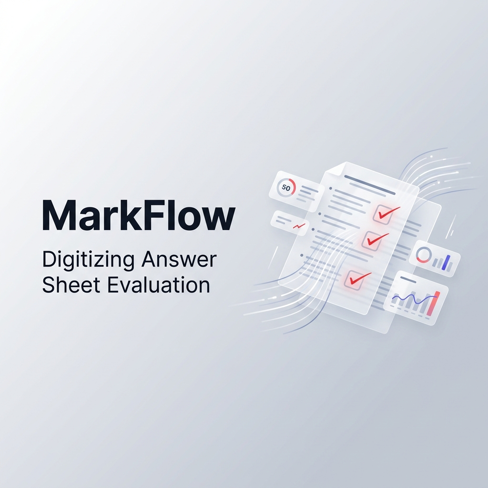
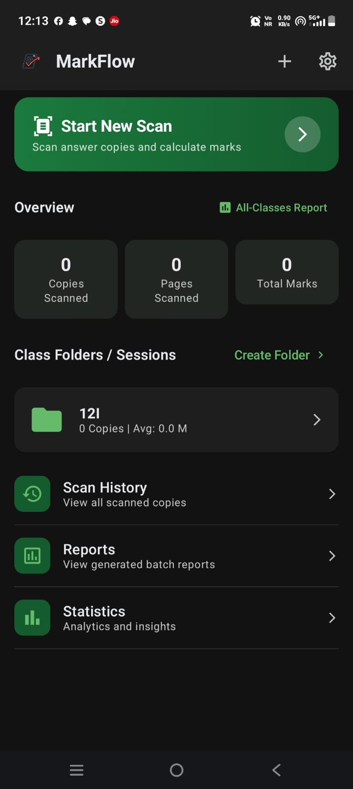
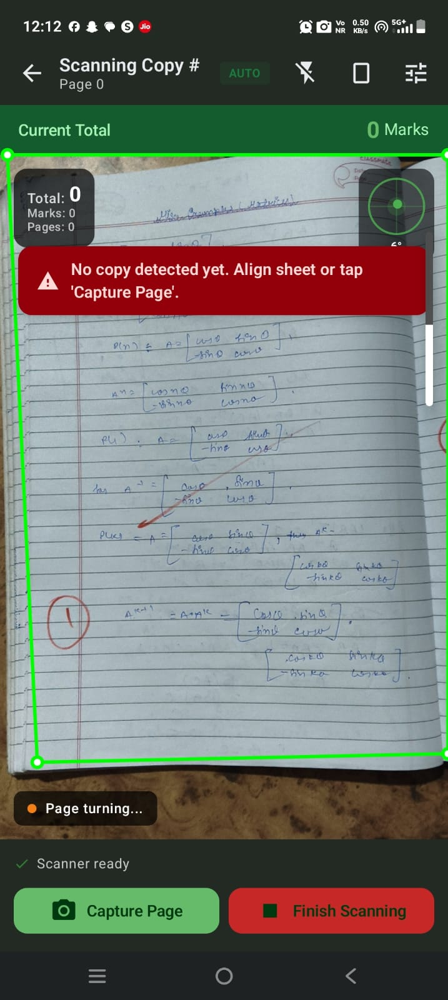
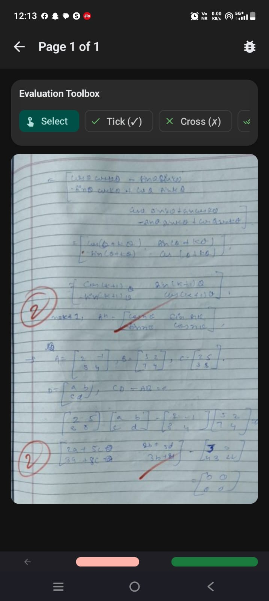
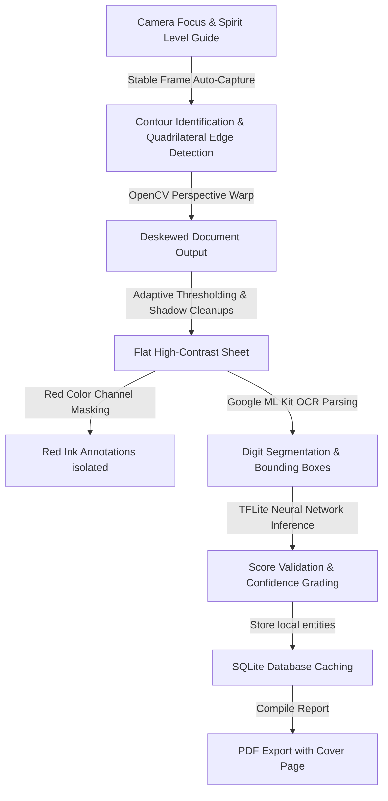

# MarkFlow 📄🖋️

[](https://github.com/adarsh0044321/markflow/releases)
[](https://github.com/adarsh0044321/markflow/actions)
[](https://developer.android.com)
[](LICENSE)

**MarkFlow** is a professional-grade Android application built for teachers and examiners to digitize, evaluate, annotate, and report on answer sheets — entirely offline, directly on their phone or tablet.

Unlike generic scanner apps, MarkFlow is an **end-to-end evaluation assistant**. It uses native computer vision (OpenCV) to deskew pages, real-time device sensors to guide alignment, on-device machine learning (ML Kit & TensorFlow Lite) to recognize handwritten marks, and interactive touch annotation tools to draw red ink checks directly onto digital sheets.



---

## 📋 Table of Contents

- [Key Features](#-key-features)
- [What's New in v2.0.0](#-whats-new-in-v200)
- [Screenshots](#-screenshots)
- [How It Works](#%EF%B8%8F-how-it-works-evaluation-pipeline)
- [Technology Stack](#%EF%B8%8F-technology-stack)
- [Installation & Building](#-installation--building)
- [Download](#-download)
- [App Architecture](#-app-architecture)
- [Project Structure](#-project-structure)
- [How to Fork & Contribute](#-how-to-fork--contribute)
- [Roadmap](#-roadmap)
- [Changelog](#-changelog)
- [License](#-license)

---

## 🌟 Key Features

### 📷 Smart Document Scanning
- **Auto Edge Detection**: Automatic quadrilateral contour detection using OpenCV's Canny edge detector and Hough transforms.
- **Perspective Deskewing**: `Imgproc.warpPerspective` flattens crumpled or angled sheets into perfect, rectangular documents.
- **Spirit Level Camera Guide**: Accelerometer-driven tilt visualizer restricts auto-capture if device tilt exceeds `10°`, preventing perspective artifacts.
- **Torch Control**: Automatically enables flash in low-light conditions (`< 15 lux` ambient light detection).

### 🔴 Red Ink & Mark Detection
- **HSV Color Filtering**: Custom adaptive red ink masking with dilation cleanup to isolate teacher corrections, ticks, crosses, and handwritten marks.
- **Multi-Pass OCR Pipeline**: Four preprocessing passes (raw, red-isolated, high-contrast, edge-enhanced) with Google ML Kit Text Recognition.
- **TensorFlow Lite Digit Verification**: A custom neural network (`digit_recognizer.tflite`) cross-validates OCR results with handwriting-aware confidence scoring.
- **Smart Mark Validation**: Only whole numbers and `0.5` increments are accepted. Out-of-range values are flagged as `NEEDS_REVIEW` with `"?"` display.

### 📐 Answer Sheet Orientation Support
- **Portrait & Landscape Modes**: First-launch orientation picker with persistent storage.
- **Quick Toggle**: Change orientation directly from the scan screen without navigating to Settings.
- **Landscape OCR Rotation**: Automatic rotation correction (0°, 90°, 180°, 270°) when landscape sheets yield low-confidence OCR.

### ✏️ Floating Annotation Toolbox
- **One-Tap Stamps**: Red Tick (✓), Cross (✗), Double Tick (✓✓ — Page Seen), Blank Page stamp.
- **Drawing Tools**: Freehand Pen, Underline (horizontal drag), Circle/Oval (drag to draw).
- **Question Numbers**: Auto-incrementing `Q1`, `Q2`, `Q3`... stamps placed directly on the page image.
- **Size Slider**: Adjustable stamp size from `24px` to `96px`.
- **Save Red Ink**: Annotations are rendered onto the page bitmap at full resolution and saved permanently.

### 📝 Sequential Mark Entry System
- **Step Marks Dialog**: Break down awarded marks into individual steps (Step 1 = `1.0`, Step 2 = `1.5`) with optional comments for each step.
- **Final Question Marks Dialog**: Shows the step subtotal, configured max marks, and allows override with strict `0.5` increment validation.
- **Swipe Navigation**: Swipe left/right within the dialog to jump between questions across pages.
- **Auto-Focus Keyboard**: Numeric fields auto-focus with `Decimal` keyboard type and `IME Next/Done` traversal.

### 📊 Class Folders & Session Analytics
- **Folder Organization**: Group student copies under custom class folders.
- **Real-Time Statistics**: Average marks, highest/lowest scores, pass rates, median, and standard deviation.
- **Audit Trails**: Complete history of mark changes tracked in the local database.

### 📄 PDF Export & Reporting
- **Cover Sheet**: Auto-generated statistics summary with pass/fail indicators.
- **High-Resolution Pages**: Full evidence pages with annotations embedded.
- **Concurrent Processing**: Background PDF generation with `Semaphore(3)` concurrency limiting.
- **Progress Tracking**: Real-time progress dialog with percentage, page count, time estimate, and cancel button.
- **Camera Shutdown on Export**: Camera session, preview, frame analysis, and ML resources are immediately released when "Finalize Copy" is tapped — prevents overheating, lag, and battery drain.

### ⚙️ Settings Screen
- **Explicit Save Button**: All numeric settings (Max Marks, Default Question Marks, Recognition Limits, Pass Threshold, Sensitivity) require deliberate saving.
- **Input Validation**: Real-time bounds checking with error highlights. Save button is disabled until all values are valid.
- **Unsaved Changes Warning**: `BackHandler` intercept dialog with "Save & Exit", "Discard Changes", and "Cancel" options.

### 💾 Offline-First Architecture
- **Room SQLite Database**: Sessions, copies, pages, marks, issues, question marks, and audit trails — all stored locally.
- **Zero Network Dependency**: The entire pipeline works without internet connectivity.

---

## 🆕 What's New in v2.0.0

> **v2.0.0 — Performance, Evaluation Toolbox & Manual Review Overhaul**

### 🚀 Performance Fixes
- **Camera Shutdown During Finalization**: Camera session, preview, and frame analysis executors are immediately released when the user taps "Finalize Copy". Prevents CPU/memory waste from dual camera + PDF processing.
- **ML Resource Cleanup**: `DigitRecognizer` interpreter is closed and frame caches are recycled during finalization.

### 🎨 Floating Annotation Toolbox
- Complete evaluation toolbox with 9 annotation types (Tick, Cross, Double Tick, Blank Page, Underline, Circle, Pen, Question Number, Select mode).
- Adjustable stamp size slider.
- Undo and Clear actions.
- Persistent bitmap rendering ("Save Red Ink").

### 📋 Sequential Step & Final Marks Dialogs
- Step-by-step mark breakdown with auto-calculated subtotals.
- Final marks dialog with override toggle and strict 0.5 increment validation.
- Swipe-to-navigate between questions across pages.

### ⚙️ Settings Screen Overhaul
- Explicit "Save Settings" button with dirty tracking.
- Input validation with error states.
- Back navigation intercept with unsaved changes confirmation dialog.

### 🔍 Smart Mark Recognition
- Strict whole number / `.5` increment enforcement.
- Max mark bounds checking from settings.
- Landscape rotation correction for OCR (tries 0°, 90°, 180°, 270°).
- Expanded edge margins for marks near page boundaries.

---

## 📸 Screenshots

| Dashboard | Real-Time Camera Scan | Evaluation Workspace |
|:---:|:---:|:---:|
|  |  |  |

---

## ⚙️ How It Works (Evaluation Pipeline)



### Step-by-Step Flow

1. **Sensor-Driven Capture** — The accelerometer controls a visual bubble overlay. Once aligned under `10°` tilt, the light sensor checks ambient brightness (enabling torch if `< 15 lux`) and auto-captures.
2. **Edge Detection & Deskewing** — Grayscale + Gaussian blur + Canny edge detection map the largest quadrilateral contour. Perspective coefficients warp the angled image into a flat document.
3. **Adaptive Image Cleaning** — Local threshold filters remove shadows, folds, and backgrounds while preserving teacher corrections and handwriting.
4. **Multi-Pass OCR & Neural Verification** — Four preprocessing passes feed Google ML Kit. The TFLite digit recognizer cross-validates with confidence scoring. Results are validated against `0.5` increment rules and max mark bounds.
5. **Manual Review & Annotation** — Teachers review detected marks, edit values through the Step/Final Marks dialogs, and annotate pages with the floating toolbox.
6. **Offline Export** — Student scores are locally cached. The app compiles PDF reports with cover sheets, cohort statistics, and high-fidelity page attachments — all with the camera fully released to maximize device resources.

---

## 🛠️ Technology Stack

| Layer | Technology |
|:---|:---|
| **Language** | Kotlin (JDK 17) |
| **UI Framework** | Jetpack Compose (Material 3) |
| **Dependency Injection** | Hilt (Dagger) |
| **Database** | Room DB (SQLite) |
| **Camera System** | CameraX API |
| **Native Libraries** | OpenCV SDK (Android port) |
| **Machine Learning** | Google ML Kit OCR & custom TensorFlow Lite Interpreter |
| **Reporting** | iText PDF (v5.x), OpenCSV |
| **Minimum SDK** | Android 10 (API 29) |
| **Target SDK** | Android 15 (API 35) |

---

## 🚀 Installation & Building

### Prerequisites
- **Android Studio** Koala / Ladybug or newer
- **Android SDK** (API 29 to 35 supported)
- **Android NDK & CMake** configured for C++ JNI compilation
- **JDK 17** (bundled with the repo under `jdk-dist/`)

### Build from Source

```bash
# 1. Clone the repository
git clone https://github.com/adarsh0044321/markflow.git
cd markflow

# 2. Build Debug APK
./gradlew assembleDebug

# 3. Build Release APK (minified + optimized)
./gradlew assembleRelease
```

### Output Locations

| Build Type | Path |
|:---|:---|
| Debug APK | `app/build/outputs/apk/debug/app-debug.apk` |
| Release APK | `app/build/outputs/apk/release/app-release-unsigned.apk` |

### Install on Device

```bash
# Install debug APK via ADB
adb install app/build/outputs/apk/debug/app-debug.apk
```

---

## 📥 Download

Download the latest pre-built APK from the [**Releases Page**](https://github.com/adarsh0044321/markflow/releases/latest).

> **Note**: The debug APK does not require signing. For production use, build the release variant with your own keystore.

---

## 🏗️ App Architecture

MarkFlow follows **MVVM (Model-View-ViewModel)** architecture with **Hilt** dependency injection:

```
┌─────────────────────────────────────────────────────┐
│                   UI Layer (Compose)                 │
│   Screens → ViewModels → StateFlows → UI State      │
├─────────────────────────────────────────────────────┤
│                 Domain Layer                         │
│   Models, Business Logic, Validation                 │
├─────────────────────────────────────────────────────┤
│                  Data Layer                          │
│   Room DAOs → Repositories → DataStore Settings      │
├─────────────────────────────────────────────────────┤
│               ML / CV Layer                          │
│   OpenCV, ML Kit OCR, TFLite DigitRecognizer         │
└─────────────────────────────────────────────────────┘
```

### Key Components

| Component | Responsibility |
|:---|:---|
| `ScanViewModel` | Camera lifecycle, frame processing, auto-capture, export mode |
| `ScanScreen` | CameraX preview, spirit level overlay, orientation toggle |
| `ImageProcessor` | OpenCV edge detection, perspective warp, image preprocessing |
| `RedInkFilter` | HSV-based red ink isolation with adaptive thresholding |
| `MarkVerifier` | 3-stage verification pipeline (CV → OCR → TFLite) |
| `PageViewViewModel` | Page navigation, mark CRUD, annotation rendering |
| `PageViewScreen` | Image viewer, annotation toolbox, step/final marks dialogs |
| `SettingsViewModel` | Pending settings state, dirty tracking, batch save |
| `ReportGenerator` | Concurrent PDF generation with progress streaming |
| `CopyRepository` | Data access layer for copies, pages, marks, sessions |

---

## 📂 Project Structure

```
markflow/
├── app/
│   └── src/main/java/com/markflow/app/
│       ├── cv/                  # Computer vision (OpenCV wrappers)
│       │   ├── ImageProcessor.kt
│       │   ├── RedInkFilter.kt
│       │   ├── ContourAnalyzer.kt
│       │   └── PageChangeDetector.kt
│       ├── ml/                  # Machine learning
│       │   ├── OcrProcessor.kt
│       │   ├── DigitRecognizer.kt
│       │   ├── MarkVerifier.kt
│       │   └── ConfidenceCalculator.kt
│       ├── data/
│       │   ├── local/dao/       # Room DAO interfaces
│       │   └── repository/      # Data repositories
│       ├── domain/model/        # Domain models (Copy, Page, Mark, etc.)
│       ├── ui/
│       │   ├── home/            # Dashboard & class folders
│       │   ├── scan/            # Camera scanning screen
│       │   ├── pageview/        # Page review & annotation toolbox
│       │   ├── settings/        # App settings with validation
│       │   ├── summary/         # Copy summary & PDF export
│       │   ├── review/          # Mark review flows
│       │   ├── reports/         # Report generation
│       │   ├── statistics/      # Analytics & charts
│       │   ├── history/         # Scan history
│       │   ├── navigation/      # NavGraph
│       │   ├── components/      # Reusable UI components
│       │   └── theme/           # Material 3 theme
│       └── util/                # Utilities & report generator
├── assets/                      # Design assets & screenshots
├── gradle/                      # Gradle wrapper
├── jdk-dist/                    # Bundled JDK 17
└── build.gradle.kts             # Root build configuration
```

---

## 🤝 How to Fork & Contribute

We welcome contributions from the community! Here's how to get started:

### 1. Fork the Repository

Click the **"Fork"** button at the top-right of the [MarkFlow GitHub page](https://github.com/adarsh0044321/markflow).

### 2. Clone Your Fork

```bash
git clone https://github.com/YOUR_USERNAME/markflow.git
cd markflow
```

### 3. Create a Feature Branch

```bash
git checkout -b feature/your-feature-name
```

### 4. Make Your Changes

- Follow the existing **MVVM architecture** pattern.
- Compose screens must use `hiltViewModel()` for ViewModel injection.
- All new settings must go through `SettingsRepository` with proper flows.
- ML changes should be tested with sample answer sheet images.
- Ensure Kotlin compilation passes: `./gradlew compileDebugKotlin`

### 5. Commit with Conventional Commits

```bash
git add .
git commit -m "feat: add new annotation tool for highlighting"
```

Use these commit prefixes:
- `feat:` — New feature
- `fix:` — Bug fix
- `perf:` — Performance improvement
- `docs:` — Documentation only
- `refactor:` — Code restructuring without behavior change
- `test:` — Adding or modifying tests

### 6. Push & Create a Pull Request

```bash
git push origin feature/your-feature-name
```

Then open a Pull Request on GitHub against the `main` branch. Include:
- A clear description of what changed and why
- Screenshots or recordings for UI changes
- Confirmation that `./gradlew assembleDebug` passes

### Contribution Guidelines

- **Architecture**: All new screens must follow MVVM with Hilt injection.
- **UI**: Use Material 3 components and the app's theme tokens.
- **Database**: Migrations must be backward-compatible. Add new columns with defaults.
- **Performance**: Recycle all `Bitmap` objects. Never hold camera resources during export.
- **Testing**: Add unit tests for business logic. Verify compilation before pushing.

---

## 📅 Roadmap

See [ROADMAP.md](ROADMAP.md) for the full product roadmap.

| Version | Status | Focus |
|:---|:---|:---|
| v1.0.0 | ✅ Released | Core scanning, OCR, PDF export |
| v1.1.0 | ✅ Released | Scanner precision & reliability |
| v1.2.0 | ✅ Released | Multi-page & batch evaluation |
| **v2.0.0** | ✅ **Released** | **Performance overhaul, annotation toolbox, manual review UX** |
| v3.0.0 | 🔮 Future | Cloud sync & teacher dashboard |

---

## 📝 Changelog

### v2.0.0 (June 2026)
- 🚀 **Camera Shutdown on Export**: Immediately releases camera, preview, and ML resources when "Finalize Copy" is tapped.
- ✏️ **Floating Annotation Toolbox**: 9 annotation tools (Tick, Cross, Double Tick, Blank Page, Underline, Circle, Pen, Question Number, Select) with size slider, undo, and persistent bitmap saving.
- 📋 **Sequential Step & Final Marks Dialogs**: Break marks into steps with auto-subtotals, override toggle, and strict `0.5` increment validation.
- ⚙️ **Settings Screen Overhaul**: Explicit save button, pending state management, dirty tracking, input validation, and back-navigation exit confirmation.
- 🔍 **Smart Mark Recognition**: Strict `.5` increment enforcement, max mark bounds checking, landscape rotation correction for OCR.
- 🔄 **Swipe Navigation**: Swipe between questions in the evaluation dialog. Cross-page navigation with auto-focus on entry fields.
- ⌨️ **Numeric Keyboard Enforcement**: All mark input fields use `Decimal` keyboard type with custom input filters (single dot, one decimal place, max value capping).
- 🧹 **Memory Safety**: Bitmap recycling in frame processing, ML interpreter cleanup, executor shutdown on composition removal.

### v1.2.0
- Multi-page document packages and batch scanning mode.
- Class folder organization and session management.
- Excel/CSV bulk export support.

### v1.1.0
- Adaptive binarization for varied lighting.
- Enhanced contour math for torn pages.
- OCR correction with max marks validation.

### v1.0.0
- Initial release with perspective deskewing, digit OCR, PDF export, and spirit level camera guide.

---

## 📄 License

This project is licensed under the **MIT License**. See [LICENSE](LICENSE) for details.

---

<p align="center">
  <b>Made with ❤️ for teachers who evaluate thousands of answer sheets.</b>
</p>
