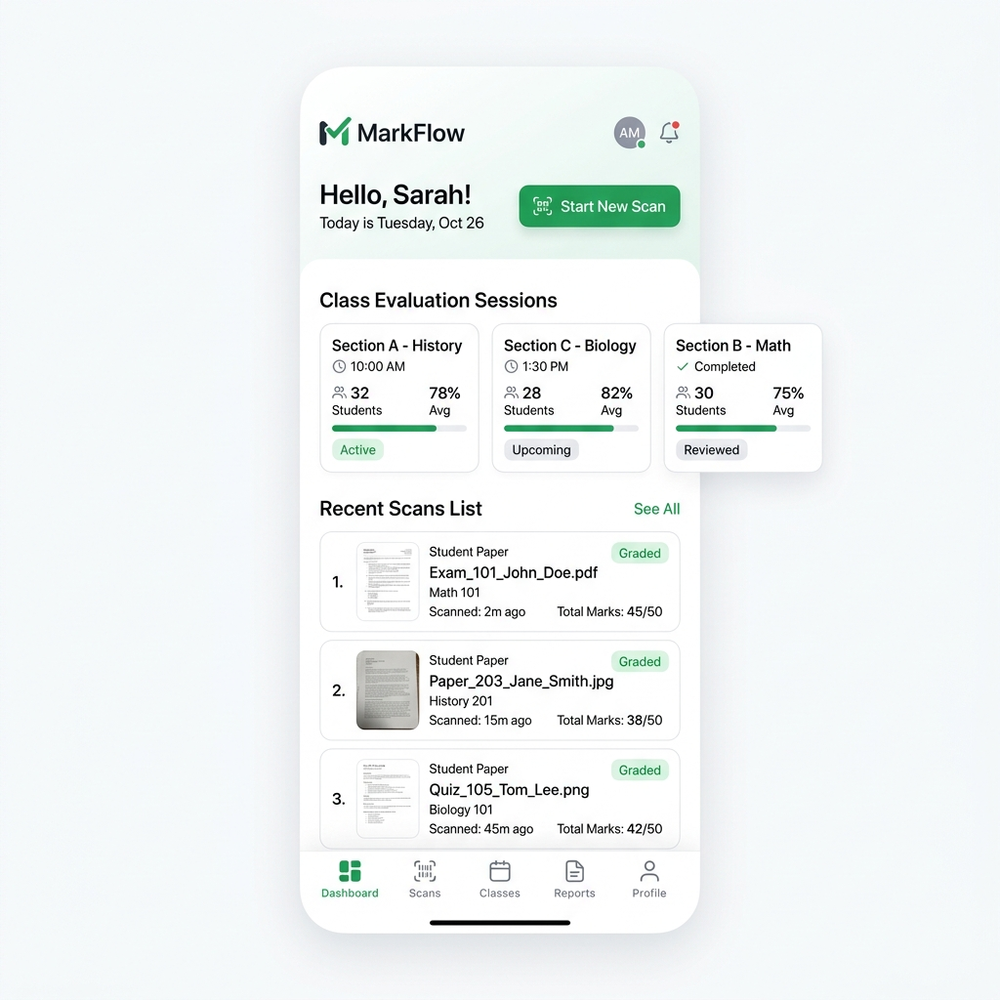
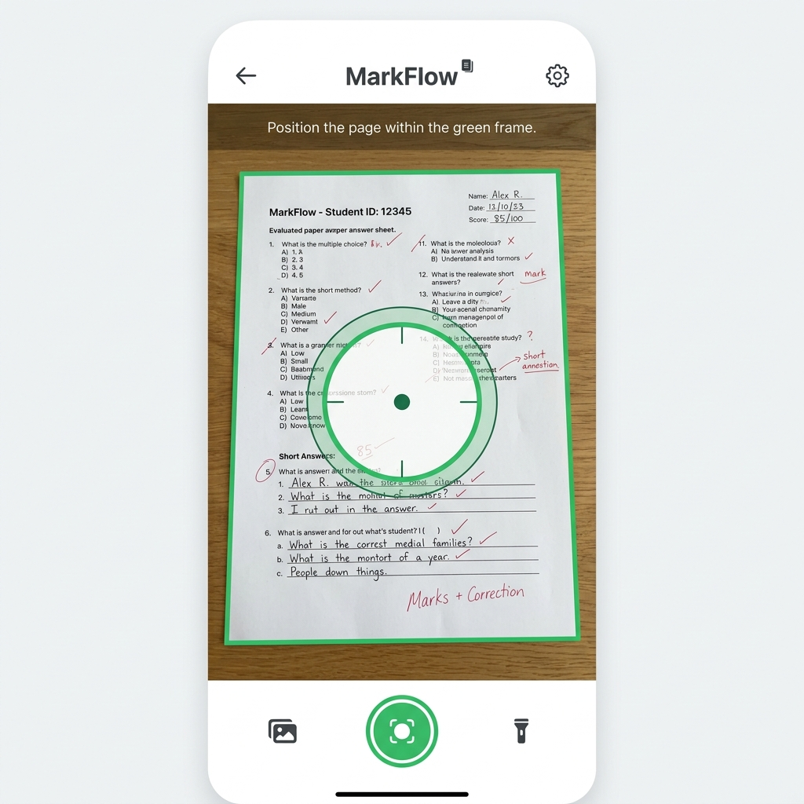
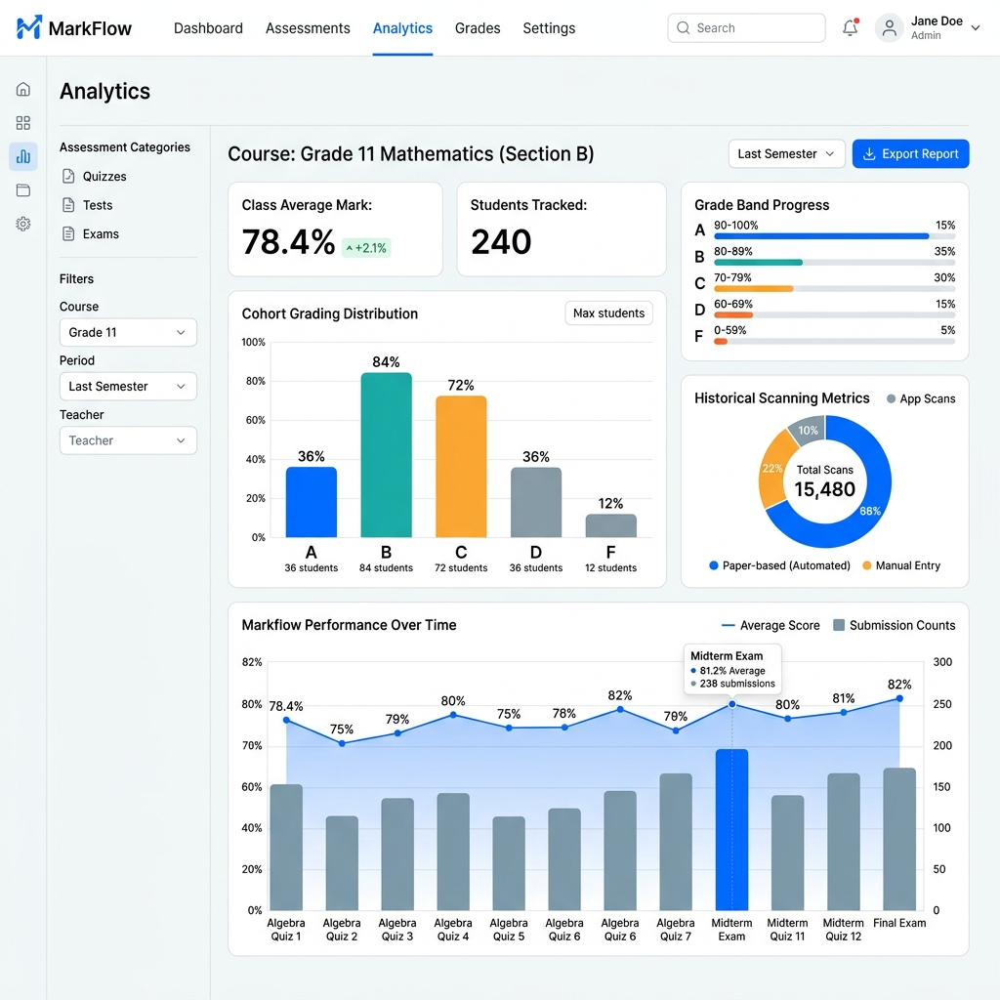
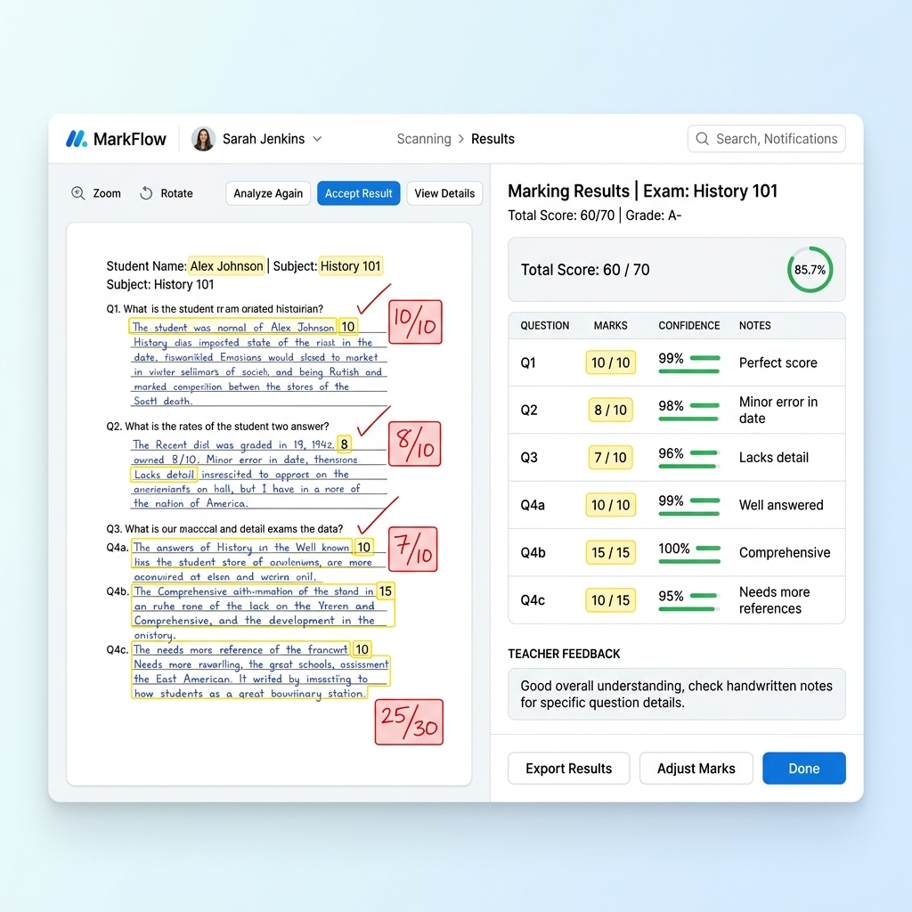
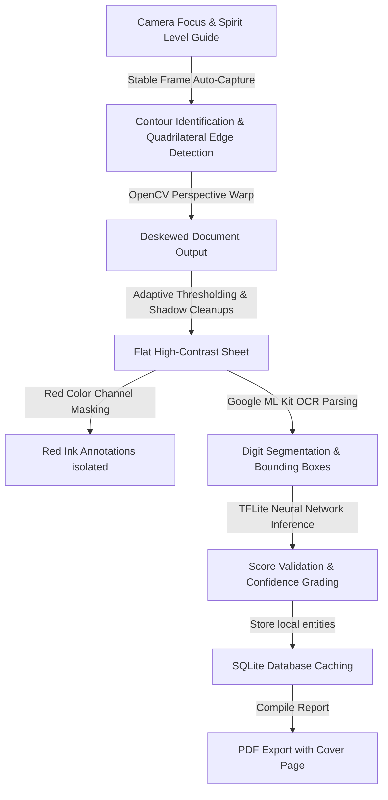

# MarkFlow 📄🖋️

[](https://github.com/adarsh0044321/markflow/releases)
[](https://github.com/adarsh0044321/markflow/actions)
[](https://developer.android.com)
[](LICENSE)

MarkFlow is a professional-grade, document-processing-first Android application designed for evaluated answer sheet digitization, verification, grading, and reporting. 

Unlike generic camera scanner apps, MarkFlow acts as an end-to-end evaluation assistant. It uses native computer vision (OpenCV) to deskew pages, real-time device sensors to guide alignment, on-device machine learning (ML Kit & TensorFlow Lite) to verify digits, and interactive touch annotation to let teachers draw red ink checks directly onto digital sheets.


---

## 🌟 Key Features

*   **⚡ Document Scanning & Deskewing**: Automatic edge detection and perspective warping (`Imgproc.warpPerspective`) that flattens crumpled or angled sheets into perfect, rectangular documents.
*   **🔴 Red Ink & Correction Detection**: Custom color-channel extraction masks that isolate and highlight teacher corrections, comments, and marks. Optimized HSV filtering and dilation cleanup ensure thin pen strokes are never lost.
*   **🔍 On-Device Digit OCR & Verification**: Runs Google ML Kit Text Recognition to segment score boxes, verified in real-time by a custom TensorFlow Lite neural network (`digit_recognizer.tflite`) with handwriting correction mapping to handle common OCR confusion characters.
*   **📁 Class Folders & Session Analytics**: Group student copies under custom class folders, view real-time statistics (average marks, highest/lowest scores, pass rates), and manage copies by folder tab.
*   **📐 Spirit Level Camera Guide**: Leverages the physical accelerometer sensor to restrict automatic image capture if the device tilt exceeds `10°`, preventing perspective distortions.
*   **📄 Cover Sheet & PDF Exporting**: Generates unified, color-styled evaluation reports using iText PDF containing automated statistics, cohort pass/fail indicators, followed by high-resolution evidence pages and summary sheets.
*   **💾 Offline-First Storage**: Uses Android Room SQLite DB to maintain audit trails, evaluation sessions, page assets, and verified grades completely offline.

---

## 📸 Screenshots

| Dashboard | Real-Time Camera Scan |
|:---:|:---:|
|  |  |
| **Evaluation Session Analytics** | **OCR Results & Marks Breakdown** |
|  |  |

---

## ⚙️ How It Works (Evaluation Pipeline)



### Step-by-Step Flow:
1.  **Sensor-Driven Capture**: The accelerometer controls a visual bubble overlay. Once aligned under `10°` tilt and resting on a flat surface, the light sensor checks ambient brightness (enabling torch if `<15 lux`) and auto-captures.
2.  **Native Computer Vision Deskewing**: Grayscale reduction, Gaussian blur, and Canny edge detection map the largest quadrilateral contour. We solve perspective coefficients to warp the angled image into a flat document.
3.  **Adaptive Image Cleaning**: Local threshold filters remove shadows, folds, and backgrounds, keeping teacher corrections and handwriting distinct.
4.  **OCR & Neural Verification**: Google ML Kit identifies digits. The bounding regions are passed to a local TensorFlow Lite model to check the teacher's handwritten marks, scoring confidence levels.
5.  **Offline Audit Trails & PDF Export**: Student scores are locally cached. The app compiles reports with cover sheets, cohort statistics, and high-fidelity page attachments.

---

## 🛠️ Technology Stack

*   **Language**: Kotlin (JDK 17)
*   **UI Framework**: Jetpack Compose (Material 3)
*   **Dependency Injection**: Hilt (Dagger)
*   **Database**: Room DB (SQLite)
*   **Camera System**: CameraX API
*   **Native Libraries**: OpenCV SDK (Android port)
*   **Machine Learning**: Google ML Kit OCR & custom TensorFlow Lite Interpreter
*   **Reporting APIs**: iText PDF (v5.x), OpenCSV

---

## 🚀 Installation & Building

### Requirements
*   Android Studio Koala/Ladybug or newer
*   Android SDK (API 29 to 35 supported)
*   Android NDK & CMake configured for C++ JNI compilation

### Gradle Build Instructions
Clone the repository and compile using the Gradle wrapper:

```bash
# Clone the repository
git clone https://github.com/adarsh0044321/markflow.git
cd markflow

# Build Debug APK
./gradlew assembleDebug

# Build Production Release APK (Minified and Optimized)
./gradlew assembleRelease
```
The compiled packages will be exported to:
*   **Debug APK**: `app/build/outputs/apk/debug/app-debug.apk`
*   **Release APK**: `app/build/outputs/apk/release/app-release-unsigned.apk`

---

## 📅 Roadmap

We are continuously evolving the evaluation assistant. See [ROADMAP.md](ROADMAP.md) for full milestones.
-   [x] **v1.1**: Improved lighting-robust contour tracking and higher OCR resolution matrices.
-   [x] **v1.2**: Batch evaluation folder scanning (multi-page document packages).
-   [ ] **v2.0**: Advanced handwriting recognition models for evaluation sheet notes.
-   [ ] **v3.0**: Cloud sync options and centralized administrative teacher dashboard.

---

## 🤝 Contributing

Contributions are welcome! Please fork the repository, create a feature branch, and submit a Pull Request. Ensure that new Compose screens conform to MVVM architectures and that native JNI changes are fully verified using local test suites.

---

## 📄 License

This project is licensed under the MIT License. See [LICENSE](LICENSE) for more details.
