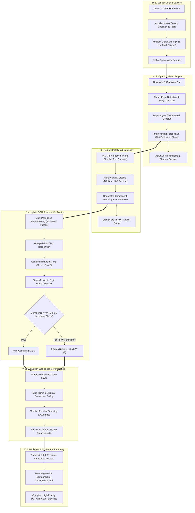
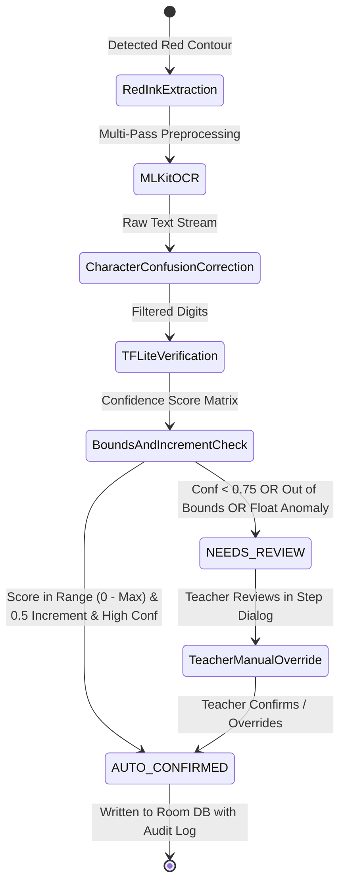
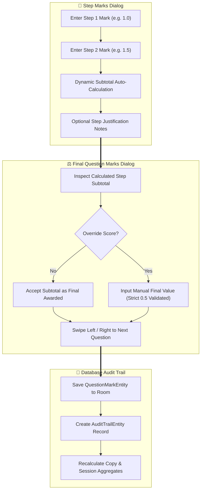

# MarkFlow 📄🖋️

**Offline-first Android exam evaluation assistant for digitizing, grading, annotating, and reporting on paper answer sheets.**

MarkFlow connects examiners, teachers, and educational institutions through an automated, on-device evaluation workflow — replacing manual paper tallying with computer-vision page alignment, ML-assisted mark recognition, floating red-ink touch annotations, and instantaneous PDF score reports.

> **SCAN → ALIGN → DESKEW → SEGMENT → VERIFY → ANNOTATE → AUDIT → EXPORT**

[](https://github.com/adarsh0044321/markflow/releases)
[](https://github.com/adarsh0044321/markflow/actions)
[](https://developer.android.com)
[](https://kotlinlang.org)
[](https://developer.android.com/jetpack/compose)
[](https://opencv.org/)
[](https://developers.google.com/ml-kit)
[](https://developer.android.com/training/data-storage/room)
[](LICENSE)

---

## 📦 Direct Downloads (v2.0.0 Release)

Pre-compiled production APK binaries configured to run out-of-the-box on Android 10.0+ (API 29+) devices:

| Application | Target Audience | Package Name | APK Download |
| :--- | :--- | :--- | :--- |
| **MarkFlow Evaluation Assistant** | Teachers, Examiners & Evaluators | `com.markflow.app` | [📥 Download Release APK (v2.0.0)](https://github.com/adarsh0044321/markflow/releases/download/v2.0.0/app-release-unsigned.apk) |
| **MarkFlow Debug Build** | Developers & Testers | `com.markflow.app` | [📥 Download Debug APK (v2.0.0)](https://github.com/adarsh0044321/markflow/releases/download/v2.0.0/app-debug.apk) |

*The complete changelog, release assets, and release verification records are available on the [Official GitHub Releases Page](https://github.com/adarsh0044321/markflow/releases).*

---

## 📌 Overview & Problem Statement

Academic examination evaluation has traditionally suffered from labor-intensive manual overhead:
* **Manual Tallying & Summation Errors**: Teachers grading hundreds of multi-page copies manually recalculate subtotals across page margins, resulting in arithmetic discrepancies and re-evaluation disputes.
* **Physical Red Ink & Paper Drag**: Carrying, sorting, and physically stamping thick bundles of paper answer sheets is cumbersome, disorganized, and prone to physical loss or damage.
* **Lack of Digital Audit Trails**: Once papers are graded, schools lack question-by-question records, timestamped change histories, or instant statistical breakdowns (averages, median, standard deviation).
* **Zero Cloud Dependence / Air-Gapped Environments**: Examination halls and evaluation centers frequently enforce strict network blackouts or suffer from spotty connectivity, rendering cloud-reliant evaluation portals unusable.

**MarkFlow** replaces slow, error-prone manual grading with an intelligent, offline-first mobile evaluation workstation. It combines native computer vision (OpenCV) for tilt-guided edge capture and perspective deskewing, on-device machine learning (Google ML Kit & custom TensorFlow Lite neural networks) for handwritten mark recognition, interactive touch-driven red ink annotation tools, and automated background PDF report compilation — running 100% locally on Android devices.

---

## 📸 Application Interface Tour

Real screenshots captured directly from physical Android hardware running the live MarkFlow evaluation platform:

### 🎓 Evaluator Workspace Experience

| Dashboard & Class Folders | Spirit-Level Camera Scan | Evaluation & Annotation Workspace |
| :---: | :---: | :---: |
|  |  |  |
| *Class folders, pass rates & cohort stats* | *Real-time tilt guide & auto-deskew capture* | *Floating red-ink stamps, pen & scoring* |

---

## 🔄 Detailed Operational Flowcharts

### 1. End-to-End Evaluation Lifecycle & Processing Pipeline
The following flowchart illustrates how a physical paper sheet travels through sensor capture, contour deskewing, red ink masking, on-device ML scoring, and final PDF generation:



---

### 2. 3-Stage Mark Verification & Classification Pipeline
MarkFlow uses a triple-layered verification architecture to ensure teachers never encounter fabricated or corrupted numerical marks:



---

### 3. Sequential Step & Question Marks Flowchart
Scoring is tracked hierarchically at the question and step level with full auditability:



---

## 🏗️ Core Modules & Architectural Features

### 📷 1. Smart Document Scanning & Sensor Guidance (`cv/`, `ui/scan/`)
- **OpenCV Contour Analysis**: Canny edge detection and convex hull quadrilateral detection identify sheet corners even with folded, crumpled, or angled paper.
- **Perspective Deskewing**: Native `Imgproc.warpPerspective` flattens skewed camera perspectives into a crisp, high-contrast, rectangular document.
- **Spirit-Level Alignment Guard**: Accelerometer orientation engine prevents camera auto-capture if device tilt exceeds `10°`, preventing optical distortion.
- **Ambient Light Sensor & Torch**: Real-time illumination meter automatically triggers the device flash if ambient light drops below `15 lux`.

### 🔴 2. Red Ink Extraction & Morphological Filtering (`cv/RedInkFilter.kt`, `cv/UncheckedAnswerDetector.kt`)
- **HSV Color Segmentation**: Separates red evaluation strokes from blue/black student handwriting using calibrated HSV ranges.
- **Morphological Closing**: Dilation followed by a 3x3 kernel erosion eliminates disconnected stroke noise while retaining original line widths for OCR parsing.
- **Unchecked Answer Detection**: Scans page regions for dark handwriting ink lacking associated red tick marks, alerting examiners of missed questions.

### 🧠 3. Hybrid AI/ML Recognition Pipeline (`ml/`)
- **Multi-Pass Preprocessing**: Runs cropped bounding boxes across raw, high-contrast, inverted, and edge-enhanced variations.
- **OCR Character Confusion Matrix**: Resolves standard OCR handwriting ambiguities (e.g., mapping `t` and `T` to digit `1`, `S` to `5`).
- **TensorFlow Lite Digit Recognizer**: Custom embedded neural model (`digit_recognizer.tflite`) validates single and multi-digit scores with confidence grading.
- **Strict Bounds & Increment Enforcement**: Restricts allowed scores to valid numbers and `0.5` increments, capping against question maximums configured in settings.

### ✏️ 4. Floating Annotation Toolbox & Canvas (`ui/pageview/`, `ui/components/`)
- **9 Specialized Tools**: Red Tick (✓), Cross (✗), Double Tick (✓✓ - Page Seen), Blank Page stamp, Freehand Pen, Horizontal Underline, Circle/Oval drag, Question Number (`Q1`, `Q2`...), and Selection mode.
- **Adjustable Tool Metrics**: Real-time stamp size slider (24px to 96px), Undo history, and Clear Canvas actions.
- **Permanent Bitmap Baking**: Renders the complete vector annotation layer directly onto the high-resolution source bitmap for immutable evidence archiving.

### 📝 5. Sequential Step-Mark Breakdown & Grading Engine (`ui/pageview/`, `data/local/`)
- **Step Breakdown**: Partition complex answers into discrete steps with individual mark allocations and rationale comments.
- **Cross-Page Swipe Navigation**: Smoothly transition between questions and pages within the scoring dialog with auto-focused numeric keypads.
- **Audit Trails**: Every score adjustment creates an immutable timestamped log tracking before-and-after values for exam integrity.

### 📊 6. Class Folder Management & Dynamic Statistics (`ui/home/`, `ui/statistics/`)
- **Session Folders**: Organize answer sheets by class, section, subject, and examination type.
- **Dynamic Cohort Analytics**: Real-time calculation of highest score, lowest score, average, median, pass percentage, and standard deviation scaled to the exam's configured maximum marks.

### 📄 7. Concurrent High-Resolution PDF & CSV Reporting (`util/ReportGenerator.kt`)
- **Concurrent PDF Engine**: Compiles complete student evaluation dossiers with cover sheets, cohort statistics, and high-resolution annotated page attachments using `Semaphore(3)` concurrency control.
- **Camera & ML Resource Release**: Immediately closes active CameraX sessions, preview executors, and ML interpreters during export to eliminate thermal throttling and battery drain.
- **Bulk CSV Export**: Generates grade spreadsheets for direct school database integration.

---

## 🛠️ Core Services & Component Directory

| Component | Layer | Key Methods / Responsibilities | Output / Impact |
| :--- | :--- | :--- | :--- |
| `ScanViewModel` | UI / Presentation | Camera lifecycle, frame analysis, auto-capture trigger, orientation toggle | Controls camera frame rate and capture state |
| `ImageProcessor` | Native CV (OpenCV) | `detectDocument()`, `warpPerspective()`, `enhanceDocumentReadability()` | Transforms raw camera frames into deskewed sheets |
| `RedInkFilter` | Computer Vision | `filterRedInk()`, `morphologicalClean()`, `extractRedRegion()` | Binary masks isolating teacher annotations |
| `UncheckedAnswerDetector` | Computer Vision | `detectUncheckedAnswers()` via direct integer array traversal | Flags missed answers with zero JNI overhead |
| `OcrProcessor` | Machine Learning | `recognizeText()`, confusion mapping, float noise truncation | Extracts candidate strings from red ink regions |
| `DigitRecognizer` | Machine Learning | `recognizeNumber()`, TFLite neural interpreter inference | Generates confidence scores for handwriting digits |
| `MarkVerifier` | Domain / Validation | 3-stage cross-validation, 0.5 increment enforcement | Labels marks as `AUTO_CONFIRMED` or `NEEDS_REVIEW` |
| `PageViewViewModel` | UI / Presentation | Annotation layer management, mark CRUD, question navigation | Drives evaluation workspace state |
| `CopyRepository` | Data Access | SQLite CRUD operations across sessions, copies, pages, and marks | Offline-first persistence via Room DAOs |
| `ReportGenerator` | Reporting / IO | `generateSessionPdfReport()`, `exportCsvReport()` | High-resolution PDF dossiers & CSV grade sheets |

---

## 💻 Technology Stack Reference

| Layer | Technology | Purpose |
| :--- | :--- | :--- |
| **Mobile Framework** | Native Android (Kotlin 1.9, SDK 35, Jetpack Compose, Material 3) | Modern, declarative, high-performance evaluator UI |
| **Architecture** | MVVM with Clean Architecture | Scalable separation of UI, business domain, and persistence |
| **Dependency Injection** | Hilt / Dagger 2 | Inversion of control across repositories, viewmodels, and ML engines |
| **Local Database** | Android Room DB (SQLite, Schema v3) | 100% offline-first storage of sessions, pages, marks, and audit logs |
| **Camera Engine** | Android CameraX (API 1.3+) | High-speed frame analysis, auto-capture, and torch control |
| **Computer Vision** | OpenCV SDK (v4.x Android JNI Port) | Real-time edge detection, perspective warping, adaptive thresholding |
| **On-Device OCR** | Google ML Kit (Text Recognition v2) | High-speed optical character recognition on cropped answer patches |
| **Neural Inference** | TensorFlow Lite (TFLite Runtime) | Embedded custom handwriting digit classification (`digit_recognizer.tflite`) |
| **Document Generation** | iText PDF (v5.x), OpenCSV | High-resolution multi-page PDF compilation and CSV data export |
| **Build System** | Gradle 8.9 (Kotlin DSL) + Bundled JDK 17 LTS | Reproducible local and CI build automation |

---

## 📂 Verified Project Structure

```text
markflow/
├── app/
│   ├── src/main/
│   │   ├── java/com/markflow/app/
│   │   │   ├── MainActivity.kt               # App entry point, M3 navigation host
│   │   │   ├── MarkFlowApp.kt                # Application class with Hilt setup
│   │   │   ├── cv/                           # OpenCV Computer Vision engines
│   │   │   │   ├── ContourAnalyzer.kt        # Quadrilateral boundary detection
│   │   │   │   ├── DuplicateDetector.kt      # Pearson correlation duplicate checker
│   │   │   │   ├── ImageProcessor.kt         # Deskewing, thresholding, contrast
│   │   │   │   ├── PageChangeDetector.kt     # Real-time page flip sensor
│   │   │   │   ├── RedInkFilter.kt           # HSV masking & morphological closing
│   │   │   │   └── UncheckedAnswerDetector.kt# Fast IntArray missed answer detector
│   │   │   ├── data/
│   │   │   │   ├── local/
│   │   │   │   │   ├── dao/                  # Room DAOs (Copy, Page, Mark, Session, Issue)
│   │   │   │   │   ├── entity/               # Room SQLite entities
│   │   │   │   │   └── MarkFlowDatabase.kt   # Room Database definition (Schema v3)
│   │   │   │   └── repository/               # Data repositories (Copy, Scan, Settings)
│   │   │   ├── di/                           # Hilt Dependency Injection modules
│   │   │   ├── domain/model/                 # Domain models (Copy, Page, Mark, Issue)
│   │   │   ├── ml/                           # On-Device Machine Learning pipeline
│   │   │   │   ├── ConfidenceCalculator.kt   # Confidence weighting (OCR vs CV vs AI)
│   │   │   │   ├── DigitRecognizer.kt        # TFLite digit recognizer interpreter
│   │   │   │   ├── MarkVerifier.kt           # 3-stage validation & 0.5 increment check
│   │   │   │   └── OcrProcessor.kt           # ML Kit OCR & confusion mapping
│   │   │   ├── ui/                           # Jetpack Compose UI Screens & ViewModels
│   │   │   │   ├── components/               # Shared UI elements (Stamps, sliders, alerts)
│   │   │   │   ├── history/                  # Scan history & evaluation archives
│   │   │   │   ├── home/                     # Class folders & cohort dashboard
│   │   │   │   ├── navigation/               # NavGraph & route destinations
│   │   │   │   ├── pageview/                 # Page evaluator & annotation toolbox
│   │   │   │   ├── reports/                  # PDF export dialogs & progress monitor
│   │   │   │   ├── review/                   # Mark discrepancy review screens
│   │   │   │   ├── scan/                     # Spirit-level camera scanning screen
│   │   │   │   ├── settings/                 # Evaluation parameters & save validation
│   │   │   │   ├── statistics/               # Analytical charts & grade distribution
│   │   │   │   ├── summary/                  # Copy evaluation summary & marksheet
│   │   │   │   └── theme/                    # Material 3 Color, Shape, Typography
│   │   │   └── util/                         # Utilities (Bitmap, File, ReportGenerator)
│   │   ├── assets/ml/                        # TFLite models (digit_recognizer.tflite)
│   │   └── res/                              # Android vector resources, icons, strings
│   ├── schemas/                              # Exported Room Database schemas
│   ├── build.gradle.kts                      # App module build configuration
│   └── proguard-rules.pro                    # R8 / ProGuard optimization rules
├── assets/                                   # Repository banners, screenshots, design
│   ├── design/                               # Project logos & social preview assets
│   └── screenshots/                          # Verified application screenshots
├── gradle/                                   # Gradle wrapper binaries
├── jdk-dist/                                 # Bundled JDK 17 LTS distribution
├── .gitignore                                # Comprehensive repository ignore rules
├── build.gradle.kts                          # Root build configuration
├── gradle.properties                         # JVM arguments & build flags
├── gradlew                                   # Unix Gradle wrapper (with JDK fallback)
├── gradlew.bat                               # Windows Gradle wrapper (with JDK fallback)
├── LICENSE                                   # MIT Open Source License
├── README.md                                 # Master Project Documentation
└── settings.gradle.kts                       # Gradle project settings
```

---

## 🚀 Getting Started & Local Development

### Prerequisites
* **Android Studio** (Koala / Ladybug or newer)
* **Android SDK** (API 29 through API 35 supported)
* **Android NDK & CMake** (configured for C++ JNI compilation)
* **JDK 17 LTS** (bundled directly in the repository under `jdk-dist/` for zero-setup builds)

### 1. Clone the Repository
```bash
git clone https://github.com/adarsh0044321/markflow.git
cd markflow
```

---

### 2. Build from Source
The Gradle wrapper scripts (`gradlew` and `gradlew.bat`) are pre-configured to automatically detect and use the bundled JDK 17, bypassing any system JDK conflicts (such as Java 26):

```bash
# Build Debug APK
./gradlew assembleDebug

# Build Release APK (minified, R8-optimized)
./gradlew assembleRelease
```

Generated APK binaries are located at:
* Debug: `app/build/outputs/apk/debug/app-debug.apk`
* Release: `app/build/outputs/apk/release/app-release-unsigned.apk`

---

### 3. Install on Physical Android Hardware
Connect your physical device via USB with **Developer Options & USB Debugging** enabled:

```bash
adb install app/build/outputs/apk/debug/app-debug.apk
```

---

## 🧪 Automated Testing & Verification

MarkFlow includes comprehensive verification protocols for unit testing, linting, and database migration integrity:

### Run Unit Tests
```bash
./gradlew testDebugUnitTest
```
*Executes unit test suites validating digit recognition thresholds, confusion mapping, and statistical cohort calculations.*

### Run Android Lint
```bash
./gradlew lintDebug
```
*Validates resource usage, accessibility standards, and Kotlin syntax rules across debug variants.*

---

## 🗺️ Roadmap

Planned development milestones for future releases:
* **Batch Document Ingestion**: Background pipeline queue that saves images instantly and processes OpenCV warps asynchronously.
* **Custom Color Stamp Sets**: Support for custom ink colors (e.g. green, black) alongside standard red stamps.
* **SQLCipher Database Encryption**: AES-256 local database encryption at rest for sensitive student records.
* **Excel / CSV Summary Charts**: Pre-generated pie charts and grade distribution graphs embedded into exported spreadsheets.
* **Multi-Page Copy Batch Scan**: Intelligent automatic grouping of multi-sheet papers using visual barcodes or student roll numbers.

---

## 🔒 Security, Privacy & Memory Safety

MarkFlow is engineered with strict offline security and native memory safeguards:
* **100% On-Device & Zero Cloud Exfiltration**: All document processing, OCR recognition, neural inference, and database storage occur strictly on-device. No student images or grades leave the physical hardware.
* **Strict Bitmap Lifecycle & Recycling**: Bitmaps are native-backed allocations. Intermediate transformation images (deskewing, contrast, sharpening, masks) are explicitly recycled immediately after processing to prevent native Out-Of-Memory (OOM) faults.
* **Hardware Lifecycle Release**: When generating reports or exiting scanning screens, the camera session, preview analyzer, and ML interpreters are immediately released to prevent overheating and battery drain.
* **Locale-Invariant Numeric Serialization**: All floating-point operations and database strings enforce `Locale.US` to eliminate decimal comma (`1,5` vs `1.5`) serialization crashes on international devices.

---

## 🤝 Contributing

Contributions and feature suggestions are welcome:
1. Fork the repository.
2. Create your feature branch (`git checkout -b feature/new-annotation-tool`).
3. Commit your changes using conventional commit prefixes:
   - `feat:` — New feature
   - `fix:` — Bug fix
   - `perf:` — Performance optimization
   - `docs:` — Documentation only
   - `refactor:` — Code restructuring without functional changes
4. Ensure Kotlin compilation and unit tests pass (`./gradlew testDebugUnitTest`).
5. Push to your branch (`git push origin feature/new-annotation-tool`).
6. Open a Pull Request on GitHub against the `main` branch.

---

## 📄 License

Distributed under the **MIT License**. See [`LICENSE`](LICENSE) for complete terms.

---

## 👨‍💻 Author

**Adarsh Kumar Singh**  
*Built as an independent software project focused on applying computer vision, on-device machine learning, and modern Android design to streamline physical academic evaluations.*
